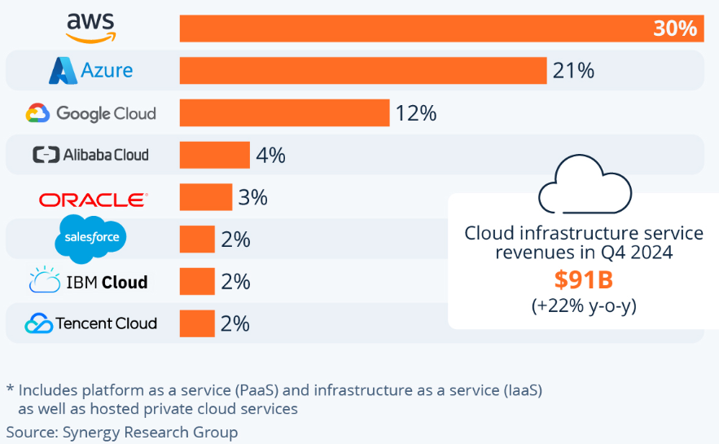

# Introduction to Cloud Computing

## What is Cloud?

Cloud computing refers to the delivery of computing services—such as servers, storage, databases, networking, software, and analytics—over the internet ("the cloud"). Instead of owning physical hardware, users can access scalable resources on demand, paying only for what they use. 

---
## History of Cloud Computing

The concept of cloud computing dates back to the 1960s, when computer scientist John McCarthy envisioned computing as a utility. However, it wasn't until the early 2000s that modern cloud services took shape:

- **2002**: Amazon launched AWS (Amazon Web Services), offering storage and computing services.
- **2006**: AWS introduced EC2 (Elastic Compute Cloud), revolutionising on-demand infrastructure.
- **Late 2000s**: Google and Microsoft entered the market with Google Cloud and Azure.
- **2010s onward**: Cloud adoption grew rapidly across industries, enabling innovations like SaaS (Software as a Service), big data processing, and AI development.

Cloud computing continues to evolve, driving digital transformation across the globe.

---
## Cloud Data Centres: Regions and Availability Zones

Cloud providers divide their infrastructure into regions—large geographic areas—and within them, multiple availability zones (AZs). Each AZ is an isolated data centre designed for fault tolerance. If one AZ fails, others continue to operate, ensuring high availability and resilience.

---
## What Are the 4 Main Cloud Deployment Models?

1. **Public Cloud**  
   Services are delivered over the internet by third-party providers (e.g., AWS, Google Cloud). Shared infrastructure, cost-effective, and scalable.

2. **Private Cloud**  
   Cloud infrastructure is dedicated to one organisation. Offers greater control and security, typically hosted on-premises or in a private data centre.

3. **Hybrid Cloud**  
   Combines public and private clouds, allowing data and applications to move between them. Useful for flexibility and gradual cloud adoption.

4. **Multi-Cloud**  
   Involves using services from multiple cloud providers (e.g., AWS, Azure, and Google Cloud together). This strategy helps avoid vendor lock-in, improves resilience, and allows organisations to optimise performance by matching workloads to the most suitable provider.

---

## What Are the 3 Main Cloud Service Types?

1. **IaaS (Infrastructure as a Service)**  
   Provides virtualised computing resources like servers, storage, and networking.  
   _Example: Amazon EC2, Microsoft Azure VMs_

2. **PaaS (Platform as a Service)**  
   Offers a platform for developers to build, test, and deploy applications without managing the underlying infrastructure.  
   _Example: Google App Engine, Heroku_

3. **SaaS (Software as a Service)**  
   Delivers software over the internet, accessible via a web browser. No installation needed.  
   _Example: Gmail, Dropbox, Microsoft 365_

### Additional Cloud Service Type: FaaS

4. **FaaS (Functions as a Service)**  
   Runs small, event-driven functions on demand without provisioning or managing servers. Ideal for ad hoc, short-lived tasks triggered by events.  
   _Example: AWS Lambda, Azure Functions_

---

## Current Market Share
Worldwide market share of leading cloud infrastructure service providers in Q4 2024.

---

## Comparison of the 3 Main Cloud Providers

| Provider | Known For                              | Key Strengths / USPs                                                                 |
|----------|----------------------------------------|--------------------------------------------------------------------------------------|
| **AWS**  | First and largest cloud platform       | Huge range of services, global infrastructure, highly scalable and reliable         |
| **Azure**| Strong enterprise and Microsoft tie-in | Best for hybrid cloud, seamless Microsoft integration, strong security & compliance |
| **GCP**  | AI, data, and Kubernetes leadership    | Cutting-edge AI/ML tools (Vertex AI), BigQuery analytics, deep Kubernetes support   |

---
## Advantages and Disadvantages of Cloud
#### Main Advantages
- **Scalability** – Easily grow or shrink resources as needed
- **Cost-efficiency** – Pay only for what you use
- **Accessibility** – Access from anywhere via the internet
- **Speed** – Quick setup and deployment

#### Main Disadvantages
- **Downtime risk** – Reliant on internet and provider uptime
- **Data control** – Less direct control over your data
- **Vendor lock-in** – Can be hard to switch providers

---

## What you pay for in the Cloud
- **Compute** (running servers, containers, functions)
- **Storage** (saving files, data, databases)
- **Networking** (data movement, load balancing)
- **Support & Licensing** (optional extras like premium support or software licences)
- **Specialised services** (advanced tools like AI or analytics)

#### Pricing Models: CapEx vs OpEx

Traditional IT requires significant upfront investment (Capital Expenditure, CapEx) in hardware and infrastructure. Cloud computing uses an Operating Expenditure (OpEx) model, where you pay only for what you use, making costs more flexible and predictable.

---

